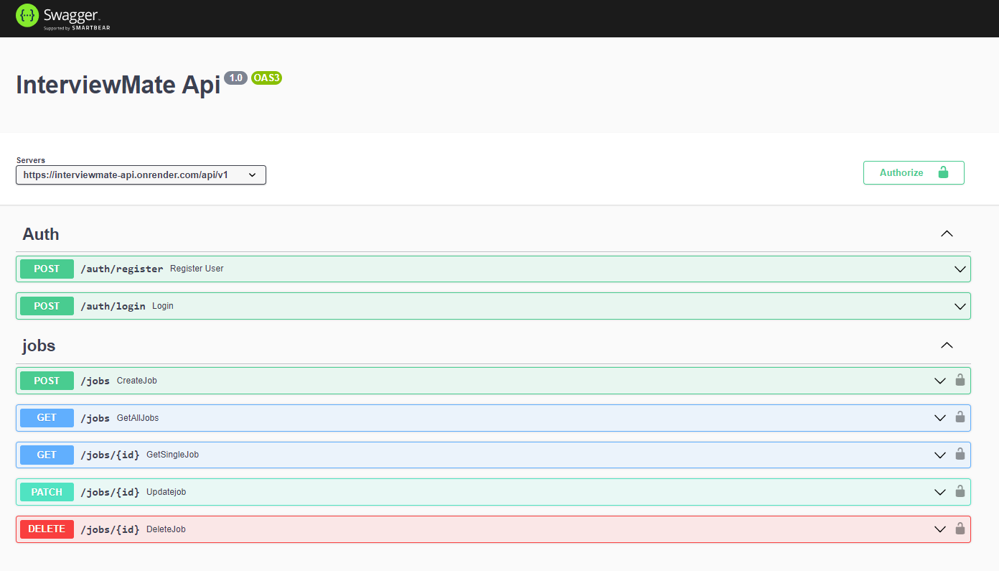

# Project Name: InterviewMate Api
> Developed a REST API that enables individuals to track their job applications.
> Live demo [_here_](https://interviewmate-api.onrender.com/api-docs/). <!-- If you have the project hosted somewhere, include the link here. -->

## Table of Contents
* [General Info](#general-information)
* [Technologies Used](#technologies-used)
* [Screenshots](#screenshots)
* [Setup](#setup)
* [Usage](#usage)
* [Project Status](#project-status)
<!-- * [License](#license) -->

## General Information
- It is a API of the web version of InterviewMate application.
- It help user to keep track of their job application with relevent status. 
- User can perform any CURD operation on jobs.
<!-- You don't have to answer all the questions - just the ones relevant to your project. -->

## Technologies & Tools Used
- Express.js, MongoDB, Mongoose
- Postman, API Matic, Swagger UI

## Screenshots

<!-- If you have screenshots you'd like to share, include them here. -->

## Setup
1) Run npm install && npm start
2) Create .env file and add you mongoDB atlus credentials with database name. (name of env variable that i have used: MONGO_URI)
3) Add secret key for generating Jsonwentoken name of env variable that i have used: JWT_SECRET)
4) Add token expiry period (name of env variable that i have used: JWT_LIFETIME)

## Usage
1) Register/Login on the given link: [_here_](https://interviewmate-api.onrender.com/api-docs/).
2) Now you will see an token in Response section
3) Copy that token and click on Authorize (on the top right hand corner)
4) Paste token and click Authorize.
5) Now you can use jobs section.

`write-your-code-here`

## Project Status
Completed

## Room for Improvement
1) To improve UI of langing page  [_here_](https://interviewmate-api.onrender.com).

